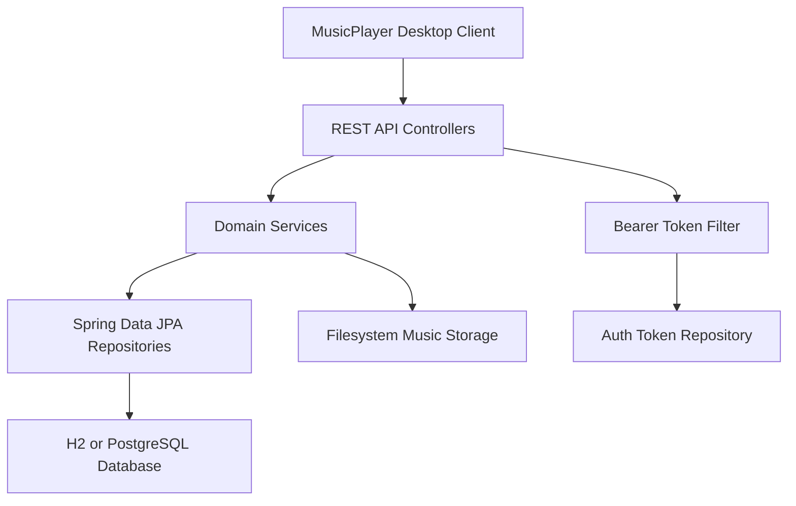

# Design Document

## Overview
MusicServer is a Spring Boot REST service that gives MusicPlayer account-based access to private music files, playlists, and favorites. The initial implementation is a modular monolith with local H2 storage and filesystem audio storage.

## Steering Document Alignment

### Technical Standards (tech.md)
The backend uses Java 17, Spring Boot 4.1.0, Spring Web MVC, Spring Security, Spring Data JPA, H2, and PostgreSQL-ready dependencies as defined in `tech.md`.

### Project Structure (structure.md)
Implementation follows the domain package boundaries in `structure.md`: `api`, `auth`, `config`, `favorite`, `music`, `playlist`, and `user`.

## Code Reuse Analysis
MusicPlayer is the existing desktop client and will consume the backend over REST. No backend code existed before this spec, so MusicServer is initialized as a sibling project.

### Existing Components to Leverage
- **MusicPlayer**: Future client integration will call `/api/auth`, `/api/music`, `/api/playlists`, and `/api/favorites`.
- **Spec Workflow Templates**: Requirements, design, and task documents follow the repository's `.spec-workflow` structure.

### Integration Points
- **Desktop Client**: Bearer-token HTTP requests from MusicPlayer.
- **Database**: H2 by default, PostgreSQL through configuration.
- **File Storage**: Local filesystem configured with `music.storage.root`.

## Architecture



### Modular Design Principles
- **Single File Responsibility**: Entities, repositories, services, controllers, and DTOs are separated.
- **Component Isolation**: Auth, music, playlist, and favorite flows live in their own packages.
- **Service Layer Separation**: Controllers delegate ownership checks and business rules to services.
- **Utility Modularity**: File storage concerns are isolated in `MusicStorageService`.

## Components and Interfaces

### Auth Module
- **Purpose:** Register, login, issue, authenticate, and revoke opaque Bearer tokens.
- **Interfaces:** `POST /api/auth/register`, `POST /api/auth/login`, `POST /api/auth/logout`, `GET /api/auth/me`.
- **Dependencies:** `AppUserRepository`, `AuthTokenRepository`, `PasswordEncoder`.

### Music Module
- **Purpose:** Store private uploaded audio, list owned files, stream files, and delete owned files.
- **Interfaces:** `GET /api/music`, `POST /api/music`, `GET /api/music/{id}`, `GET /api/music/{id}/stream`, `DELETE /api/music/{id}`.
- **Dependencies:** `MusicFileRepository`, `MusicStorageService`.

### Playlist Module
- **Purpose:** Manage owned playlists and playlist tracks.
- **Interfaces:** `GET/POST /api/playlists`, `GET/PUT/DELETE /api/playlists/{id}`, `POST /api/playlists/{id}/tracks`, `DELETE /api/playlists/{id}/tracks/{musicId}`.
- **Dependencies:** `PlaylistRepository`, `PlaylistTrackRepository`, `MusicService`.

### Favorite Module
- **Purpose:** Maintain a user's default favorites collection.
- **Interfaces:** `GET /api/favorites`, `POST /api/favorites/{musicId}`, `DELETE /api/favorites/{musicId}`.
- **Dependencies:** `FavoriteTrackRepository`, `MusicService`.

## Data Models

### AppUser
```
- id: Long
- username: unique string
- passwordHash: BCrypt string
- displayName: string
- createdAt / updatedAt: Instant
```

### AuthToken
```
- id: Long
- tokenHash: SHA-256 hex string
- user: AppUser
- expiresAt / createdAt / revokedAt: Instant
```

### MusicFile
```
- id: Long
- owner: AppUser
- originalFilename: string
- storagePath: string
- title / artist / album: string
- contentType: string
- fileSize: long
- checksum: SHA-256 hex string
- createdAt / updatedAt: Instant
```

### Playlist and PlaylistTrack
```
Playlist:
- id: Long
- owner: AppUser
- name / description: string
- tracks: ordered PlaylistTrack list

PlaylistTrack:
- id: Long
- playlist: Playlist
- music: MusicFile
- sortOrder: int
- createdAt: Instant
```

### FavoriteTrack
```
- id: Long
- owner: AppUser
- music: MusicFile
- createdAt: Instant
```

## Error Handling

### Error Scenarios
1. **Invalid credentials**
   - **Handling:** Return HTTP 401 with JSON error.
   - **User Impact:** MusicPlayer can show login failure.

2. **Accessing another user's resource**
   - **Handling:** Query by ID and owner; return HTTP 404 when not found.
   - **User Impact:** Private resources are not disclosed.

3. **Unsupported upload**
   - **Handling:** Return HTTP 400 for empty or unsupported files.
   - **User Impact:** MusicPlayer can show a local upload validation message.

## Testing Strategy

### Unit Testing
- Test `AuthService`, `TokenService`, `MusicStorageService`, playlist idempotency, and favorite idempotency.

### Integration Testing
- Use Spring Boot tests with H2 to cover register, login, upload, playlist add, favorite add, and stream authorization.

### End-to-End Testing
- Once MusicPlayer integration begins, run desktop flows against a local MusicServer instance.
