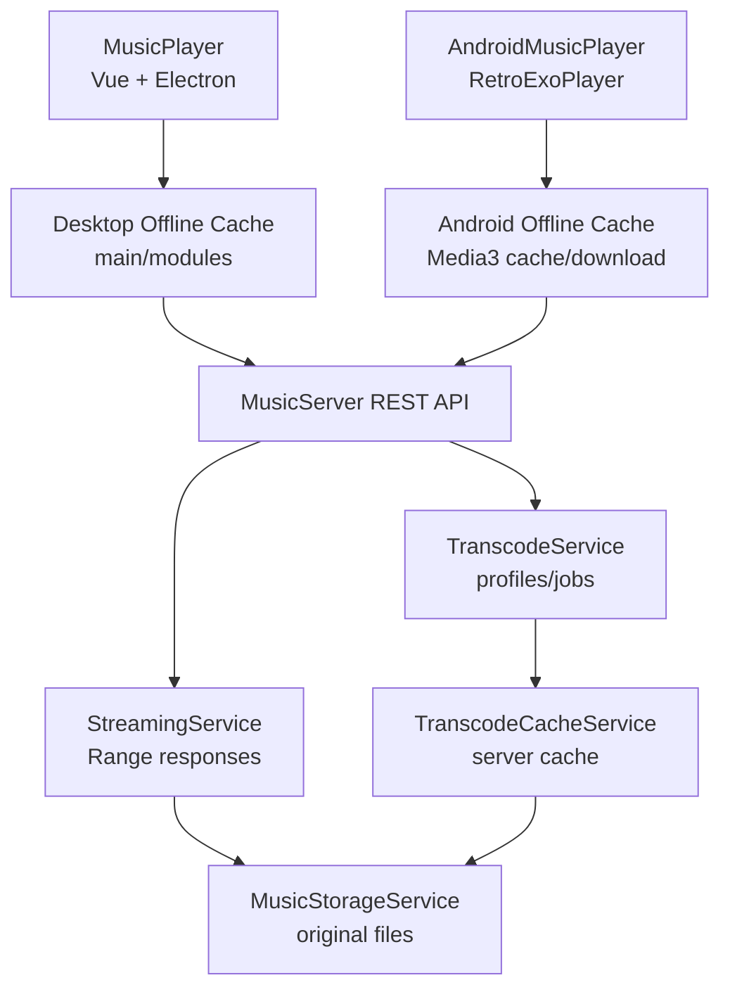

# Design Document

## Overview

本设计为 CH Music 增加完整的 Range、转码和离线缓存能力，覆盖 MusicServer、MusicPlayer 和 AndroidMusicPlayer 三端。

设计分为三层：

1. **MusicServer 流媒体核心**：为原始音频和转码音频提供标准 HTTP Range 响应、能力元数据、转码任务和服务端转码缓存。
2. **MusicPlayer 桌面离线缓存**：复用现有 Electron 主进程磁盘缓存和下载队列能力，增加 MusicServer 私有曲库的账号隔离、checksum 校验、断点下载和播放 URL 选择。
3. **AndroidMusicPlayer 离线缓存**：围绕现有 `RetroExoPlayer` 和 `musicserver` 包，引入 Media3/ExoPlayer 兼容缓存数据源、下载队列、账号隔离索引和弱网策略。

目标是先建立稳定的 API 和缓存语义，再逐步实现 UI 控制。原始播放保持向后兼容；转码是可选能力，未启用时客户端仍能播放原始流。

## Steering Document Alignment

### Technical Standards (tech.md)

- 遵循“多客户端 + 单一私有后端”的边界：转码、Range、服务端缓存归 MusicServer；桌面和 Android 只通过 HTTP API 与元数据协商。
- MusicServer 继续使用 Spring Boot 模块化单体，新增逻辑按 `music`、`config`、`api` 分层，不把复杂业务塞进 Controller。
- FFmpeg 作为可选外部依赖，通过配置检测和能力元数据暴露，不作为 MusicServer 启动硬依赖。
- Android 端优先复用 Media3/ExoPlayer 生态，不手写播放核心。
- MusicPlayer 复用现有 Electron 主进程下载、缓存、文件系统和 IPC 模式。

### Project Structure (structure.md)

- MusicServer 新增类放在 `MusicServer/src/main/java/com/chmusic/musicserver/music/` 和 `config/`，Controller 仍在 `api/`。
- MusicPlayer 主进程新增离线缓存能力放在 `MusicPlayer/src/main/modules/`，渲染进程状态放在 `src/renderer/store/modules/`，类型放在 `src/renderer/types/`。
- AndroidMusicPlayer 的 MusicServer 离线能力集中在 `app/src/main/java/code/name/monkey/retromusic/musicserver/`，播放器接入点保留在 `service/RetroExoPlayer.kt`。
- 文档和后续任务放在 `.spec-workflow/specs/streaming-transcoding-offline-cache/`。

## Code Reuse Analysis

### Existing Components to Leverage

- **MusicController**：扩展 `/api/music/{musicId}/stream`，新增转码 profile 和状态相关接口。
- **MusicService / MusicStorageService**：继续负责归属校验、原始文件定位、路径安全和删除原始文件。
- **MusicResponse**：扩展播放能力、checksum、版本和转码 profile 元数据。
- **MusicServerProperties**：扩展转码、流媒体和缓存配置项。
- **MusicPlayer `src/main/modules/cache.ts`**：复用磁盘缓存目录、缓存统计、清理策略和 IPC 初始化模式。
- **MusicPlayer `downloadManager.ts`**：复用任务队列、进度、暂停/恢复、完成记录等模型。
- **MusicPlayer `api/musicServer.ts` / `musicServer` store**：扩展能力字段、转码状态和离线缓存状态。
- **Android `MusicServerRepository` / `MusicServerSongMapper`**：扩展缓存元数据、播放 URL 选择和离线状态。
- **Android `RetroExoPlayer`**：改造 ExoPlayer 构建，接入可缓存 DataSource.Factory。

### Integration Points

- **MusicServer API**：`/api/music` 列表与详情返回能力元数据；`/stream` 支持 Range；新增转码准备和状态接口。
- **Database/Storage**：MusicServer 新增转码产物索引；原始音乐继续使用 `MusicFile` 与文件系统。
- **Electron IPC**：新增 MusicServer 离线缓存 IPC，如 `music-server-cache:add`、`music-server-cache:get-state`、`music-server-cache:remove`。
- **Android DI**：通过 Koin 注入 MusicServer 缓存管理器、下载管理器和 ExoPlayer DataSource 工厂。

## Architecture



### Modular Design Principles

- **Single File Responsibility**: Range 响应、转码 profile、任务队列、转码缓存、桌面缓存、Android 缓存分别放在不同服务。
- **Component Isolation**: 客户端 UI 不直接读写缓存文件，只通过 store/repository 与缓存服务通信。
- **Service Layer Separation**: Controller 只解析请求；service 处理业务；storage/cache 处理文件；repository 处理数据库。
- **Utility Modularity**: checksum 校验、Range 解析、profile 选择、缓存 key 计算独立成可测试工具。

## Components and Interfaces

### MusicServer: StreamingService

- **Purpose:** 为原始文件和转码文件生成标准 HTTP Range 响应。
- **Interfaces:**
  - `ResponseEntity<?> streamOriginal(AppUser owner, Long musicId, HttpHeaders headers)`
  - `ResponseEntity<?> streamVariant(AppUser owner, Long musicId, String profileId, HttpHeaders headers)`
  - `StreamResource resolveOriginal(AppUser owner, Long musicId)`
  - `StreamResource resolveVariant(AppUser owner, Long musicId, String profileId)`
- **Dependencies:** `MusicService`、`MusicStorageService`、`TranscodeCacheService`、Spring `HttpRange`。
- **Reuses:** 现有 `requireOwnedMusic` 和 `pathOf`。

### MusicServer: TranscodeProfileCatalog

- **Purpose:** 管理可用转码 profile，声明输出格式、码率、容器、MIME 和是否适合离线缓存。
- **Interfaces:**
  - `List<TranscodeProfile> enabledProfiles()`
  - `Optional<TranscodeProfile> find(String profileId)`
  - `boolean isAvailable()`
- **Dependencies:** `MusicServerProperties`、`TranscodeToolProbe`。
- **Reuses:** 配置属性体系。

### MusicServer: TranscodeService

- **Purpose:** 创建、复用、查询和执行转码任务。
- **Interfaces:**
  - `TranscodeStatus prepare(AppUser owner, Long musicId, String profileId)`
  - `TranscodeStatus status(AppUser owner, Long musicId, String profileId)`
  - `Path requireReadyVariant(AppUser owner, Long musicId, String profileId)`
- **Dependencies:** `MusicFileRepository`、`TranscodeVariantRepository`、`TranscodeJobRepository`、`TranscodeExecutor`、`TranscodeCacheService`。
- **Reuses:** `MusicFile.checksum`、`storagePath` 和 owner 校验。

### MusicServer: TranscodeExecutor

- **Purpose:** 封装 FFmpeg 调用、并发限制、超时和失败记录。
- **Interfaces:**
  - `TranscodeResult execute(MusicFile source, TranscodeProfile profile, Path output)`
  - `boolean canExecute()`
- **Dependencies:** FFmpeg 可执行文件路径、进程执行器、临时目录。
- **Reuses:** 无，新增独立服务。

### MusicServer: TranscodeCacheService

- **Purpose:** 管理服务端转码产物存储、清理、容量统计和源文件变更失效。
- **Interfaces:**
  - `Path variantPath(MusicFile music, TranscodeProfile profile)`
  - `boolean isValid(TranscodeVariant variant, MusicFile music)`
  - `void deleteVariants(MusicFile music)`
  - `CacheStats stats()`
  - `void pruneIfNeeded()`
- **Dependencies:** 文件系统、`MusicServerProperties`、转码 variant repository。
- **Reuses:** `MusicStorageService` 的路径安全思想。

### MusicServer API Extensions

- **Purpose:** 暴露播放能力、转码状态和 stream profile。
- **Interfaces:**
  - `GET /api/music`
  - `GET /api/music/{musicId}`
  - `GET /api/music/{musicId}/stream?profile=original|aac-128|mp3-192`
  - `POST /api/music/{musicId}/transcodes/{profileId}`
  - `GET /api/music/{musicId}/transcodes/{profileId}`
  - `GET /api/music/transcode-capabilities`
- **Dependencies:** `StreamingService`、`TranscodeService`。
- **Reuses:** `MusicController` 与 `MusicResponse`。

### MusicPlayer: MusicServerOfflineCacheManager

- **Purpose:** 在 Electron 主进程管理私有音乐离线缓存、下载、断点续传、checksum 校验、账号隔离和清理。
- **Interfaces:**
  - `addItems(items: MusicServerCacheRequest[]): Promise<string[]>`
  - `pause(taskId: string): Promise<void>`
  - `resume(taskId: string): Promise<void>`
  - `remove(cacheKey: string): Promise<void>`
  - `resolvePlaybackUrl(music: MusicServerMusic): Promise<string | null>`
  - `syncIndex(serverKey: string, userId: number, musicList: MusicServerMusic[]): Promise<CacheSyncResult>`
- **Dependencies:** 现有 `DiskCacheManager`、`downloadManager` 经验、`electron-store`、Node 文件系统、fetch/axios。
- **Reuses:** `cache.ts` 的目录、统计、清理和 `downloadManager.ts` 的任务模式。

### MusicPlayer: Renderer Store and UI State

- **Purpose:** 在 `musicServer` store 中展示缓存状态，并为视图提供缓存/移除/重试动作。
- **Interfaces:**
  - `cacheStates: Record<string, MusicServerOfflineState>`
  - `cacheMusic(musicId: number)`
  - `cachePlaylist(playlistId: number)`
  - `removeCachedMusic(musicId: number)`
  - `resolveMusicServerPlaybackUrl(music: MusicServerMusic)`
- **Dependencies:** Electron preload API、`api/musicServer.ts`、`toMusicServerSongResult`。
- **Reuses:** 现有 Pinia store 和音乐映射函数。

### Android: MusicServerCacheManager

- **Purpose:** 管理 Android 端离线缓存索引、下载队列、checksum 校验、网络偏好和账号隔离。
- **Interfaces:**
  - `suspend fun enqueue(music: MusicServerMusic, profileId: String?)`
  - `suspend fun remove(musicId: Long)`
  - `fun stateFlow(): StateFlow<Map<Long, MusicServerCacheState>>`
  - `fun resolvePlayableUri(music: MusicServerMusic): Uri`
  - `suspend fun sync(serverState: MusicServerState)`
- **Dependencies:** Media3 cache/download、SharedPreferences 或 Room、`MusicServerSession`、`MusicServerRepository`。
- **Reuses:** `MusicServerSongMapper`、`RetroExoPlayer`。

### Android: CachedDataSource Integration

- **Purpose:** 让 ExoPlayer 使用带 token 的 HTTP 数据源和本地缓存数据源。
- **Interfaces:**
  - `MusicServerDataSourceFactory.create(): DataSource.Factory`
  - `RetroExoPlayer` 使用可注入的 `MediaSource.Factory` 或 DataSource.Factory。
- **Dependencies:** Media3 `CacheDataSource.Factory`、OkHttp/DefaultHttpDataSource、MusicServerSession。
- **Reuses:** 当前 ExoPlayer 播放路径。

## Data Models

### MusicResponse Extension

```java
record MusicResponse(
    String id,
    Long musicId,
    Long trackId,
    String source,
    String externalId,
    String title,
    String artist,
    String album,
    String picUrl,
    Long duration,
    String originalFilename,
    String contentType,
    long fileSize,
    String checksum,
    Instant createdAt,
    Instant updatedAt,
    String streamUrl,
    PlaybackCapabilities playback
)
```

### PlaybackCapabilities

```java
record PlaybackCapabilities(
    boolean supportsRange,
    boolean supportsOriginal,
    boolean supportsTranscoding,
    boolean supportsOfflineCache,
    List<PlaybackVariant> variants
)
```

### PlaybackVariant

```java
record PlaybackVariant(
    String profileId,
    String label,
    String contentType,
    Integer bitrateKbps,
    String streamUrl,
    TranscodeState state,
    Long fileSize,
    String checksum
)
```

### TranscodeVariant Entity

```java
class TranscodeVariant {
    Long id;
    MusicFile music;
    AppUser owner;
    String profileId;
    String contentType;
    Integer bitrateKbps;
    String storagePath;
    long fileSize;
    String sourceChecksum;
    String variantChecksum;
    TranscodeState state;
    String errorCode;
    String errorMessage;
    Instant createdAt;
    Instant updatedAt;
    Instant lastAccessedAt;
}
```

### TranscodeState

```java
enum TranscodeState {
    UNAVAILABLE,
    NOT_REQUESTED,
    QUEUED,
    PROCESSING,
    READY,
    FAILED,
    STALE
}
```

### Desktop Offline Cache Entry

```ts
interface MusicServerOfflineCacheEntry {
  cacheKey: string;
  serverBaseUrl: string;
  userId: number;
  musicId: number;
  profileId: string;
  title: string;
  checksum: string;
  fileSize: number;
  contentType: string;
  localPath: string;
  state: 'queued' | 'downloading' | 'ready' | 'failed' | 'stale' | 'paused';
  downloadedBytes: number;
  lastVerifiedAt?: number;
  pinned: boolean;
  error?: string;
}
```

### Android Offline Cache Entry

```kotlin
data class MusicServerCacheEntry(
    val cacheKey: String,
    val serverBaseUrl: String,
    val userId: Long,
    val musicId: Long,
    val profileId: String,
    val checksum: String,
    val fileSize: Long,
    val contentType: String,
    val state: MusicServerCacheState,
    val downloadedBytes: Long,
    val pinned: Boolean,
    val updatedAt: Long,
    val error: String?
)
```

## API Design

### Stream Endpoint

```http
GET /api/music/{musicId}/stream?profile=original
Authorization: Bearer <token>
Range: bytes=0-1048575
```

Responses:

- `200 OK` for full content
- `206 Partial Content` for valid single range
- `416 Range Not Satisfiable` for invalid range
- `202 Accepted` is not used for stream; if profile is not ready, the endpoint returns `409 Conflict` or `425 Too Early` with structured body so clients call prepare/status.

### Prepare Transcode

```http
POST /api/music/{musicId}/transcodes/{profileId}
```

Response:

```json
{
  "musicId": 12,
  "profileId": "aac-128",
  "state": "QUEUED",
  "streamUrl": "/api/music/12/stream?profile=aac-128",
  "retryAfterSeconds": 3
}
```

### Transcode Capabilities

```http
GET /api/music/transcode-capabilities
```

Response:

```json
{
  "enabled": true,
  "toolAvailable": true,
  "profiles": [
    {
      "profileId": "aac-128",
      "label": "AAC 128 kbps",
      "contentType": "audio/aac",
      "bitrateKbps": 128,
      "offlineCacheable": true
    }
  ]
}
```

## Configuration

MusicServer properties:

```properties
music.streaming.range.enabled=true
music.transcoding.enabled=false
music.transcoding.ffmpeg-path=ffmpeg
music.transcoding.max-concurrency=1
music.transcoding.temp-root=./.local/transcode-temp
music.transcoding.cache-root=./.local/transcode-cache
music.transcoding.cache-max-size=20GB
music.transcoding.profiles[0].id=aac-128
music.transcoding.profiles[0].content-type=audio/aac
music.transcoding.profiles[0].bitrate-kbps=128
music.transcoding.profiles[0].extension=aac
music.transcoding.profiles[0].args=-vn -c:a aac -b:a 128k
```

Client settings:

- MusicPlayer: cache root, max size, Wi-Fi only not applicable by default, pinned offline tracks.
- AndroidMusicPlayer: Wi-Fi only downloads, cache max size, allow mobile streaming transcode preference, pinned offline tracks.

## Error Handling

### Error Scenarios

1. **Invalid Range**
   - **Handling:** Return `416 Range Not Satisfiable` with `Content-Range: bytes */{length}`.
   - **User Impact:** Player retries or shows unplayable state; logs indicate invalid range.

2. **Profile Not Ready**
   - **Handling:** Return structured error from stream endpoint; clients call prepare endpoint and poll status.
   - **User Impact:** UI shows “转码准备中”，then retries playback when ready.

3. **FFmpeg Missing**
   - **Handling:** Capabilities return `enabled=false` or `toolAvailable=false`; prepare returns configuration error.
   - **User Impact:** Transcode choices hidden or disabled; original playback remains.

4. **Transcode Failure**
   - **Handling:** Persist `FAILED` state with sanitized error; allow retry.
   - **User Impact:** UI shows failure reason and retry; original playback can be used.

5. **Disk Full**
   - **Handling:** Server pauses transcode cache writes; clients pause downloads and mark cache task failed/retryable.
   - **User Impact:** User sees storage warning and can clear cache.

6. **Token Expired**
   - **Handling:** API returns `401`; client pauses protected downloads and asks login.
   - **User Impact:** Cached valid files still playable offline; new downloads require login.

7. **Source Changed**
   - **Handling:** checksum mismatch marks server variant and client cache stale.
   - **User Impact:** Client re-downloads or falls back online.

8. **Cross Account Cache Access**
   - **Handling:** Cache namespace includes normalized server URL and user ID; lookup refuses mismatched namespace.
   - **User Impact:** Previous account cache not shown or played.

## Security Design

- All stream, transcode and cache prepare/status APIs require authenticated owner.
- Stream endpoint continues to support `Authorization` header and current token query compatibility for player components that cannot set headers.
- Token query values are never logged; request logging should redact `access_token`.
- Transcode output paths are generated from IDs/profile/checksum, not user-provided filenames.
- Cache roots are normalized and checked before read/delete operations.
- Client offline cache index stores server/user namespace and checksum; private caches are not listed across accounts.

## Performance Design

- Range response uses streaming resource or region response; no full-file byte array reads.
- Single-range is first-class. Multi-range can be rejected with `416` or simplified to first range in initial implementation, but this behavior must be documented and tested.
- Transcoding runs in bounded executor with default concurrency `1`.
- Transcode temp files are written atomically: write to temp, fsync/close where feasible, then move into cache path.
- Cache cleanup runs after successful transcode and at startup, never in the hot response path unless capacity is critically exceeded.
- Desktop and Android downloads use resumable byte ranges where possible.

## Testing Strategy

### Unit Testing

- MusicServer Range parser/response builder:
  - no Range returns 200
  - `bytes=0-99` returns correct 206 headers
  - `bytes=100-` open-ended range
  - `bytes=-500` suffix range
  - invalid/out-of-bounds range returns 416
- Transcode profile catalog:
  - enabled/disabled config
  - unsupported profile
  - FFmpeg unavailable
- Transcode cache service:
  - checksum match valid
  - checksum mismatch stale
  - delete variants on music delete
  - capacity cleanup does not delete originals
- Desktop cache key and namespace helpers.
- Android cache key and state transition helpers.

### Integration Testing

- MusicServer WebMVC tests for `/api/music/{id}/stream` with and without Range.
- MusicServer auth tests ensure user A cannot stream or transcode user B music.
- MusicServer prepare/status/stream transcode flow with a fake executor.
- MusicPlayer main-process cache tests with temporary directories and mocked HTTP server.
- Android repository/cache tests with fake MusicServer API and temp cache.

### End-to-End Testing

- Upload music, play original, seek to later position, verify Range playback.
- Request transcode, show preparing state, play ready transcode.
- Cache a private song on desktop, disconnect server, play local cached copy.
- Cache a private song on Android, restart app, play cached copy through ExoPlayer.
- Delete source music on server, refresh client, verify cache becomes stale or hidden.
- Switch account, verify previous account cache is not visible.

## Migration and Rollout

1. Ship Range support first because it is backward compatible and improves existing stream URL immediately.
2. Add playback capability metadata to `MusicResponse` while keeping existing fields unchanged.
3. Add transcode configuration disabled by default.
4. Add fake-executor tests and optional FFmpeg-backed implementation.
5. Add desktop offline cache with no UI risk by exposing store state first.
6. Add Android cache data source and download queue behind a setting.
7. Gradually surface UI controls for cache and quality selection.

## Requirement Traceability

- Requirement 1: `StreamingService`, stream endpoint, Range tests.
- Requirement 2: `PlaybackCapabilities`, `PlaybackVariant`, stream profile query, capabilities endpoint.
- Requirement 3: `TranscodeService`, `TranscodeExecutor`, job states.
- Requirement 4: `TranscodeCacheService`, `TranscodeVariant`, cleanup.
- Requirement 5: `MusicServerOfflineCacheManager`, desktop store and IPC.
- Requirement 6: `MusicServerCacheManager`, Android Media3 cache/download integration.
- Requirement 7: checksum/version fields, namespace keys, sync methods.
- Requirement 8: status fields, client UI state, server config and sanitized logging.
